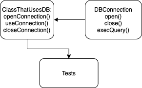

# 32.6. Итоговое задание

**Задача**

Задание: создать тесты с моком объекта, имитирующим подключение к базе данных.
Подробнее: напишите реализацию классов (которые будут участвовать в тестах), как показано на схеме:

Семантика (входные параметры и возвращаемые значения) методов определяются вами. Напишите тесты с использованием методологии TDD, фреймворков GTest и GMock.

**Реализовано:**

- DBConnection реализован с использованием интерфейсов.
- Для интерфейса DBConnection создан мок класс.
- Написана группа тестов покрывающая все методы из класса ClassThatUsesDB.
- В классе ClassThatUsesDB используется интерфейс DBConnection таким образом, что его можно подменить на мок-объект.